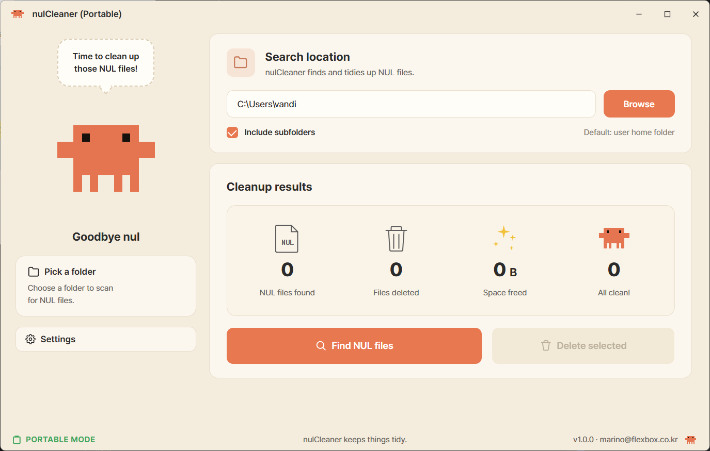

# nulCleaner

A tiny portable Windows tool that finds and deletes files literally named `nul`.

Created by accident? Yes. Annoying to remove? Also yes. That's the whole job.



## Why this exists

On Windows, `nul` is a reserved device name. When something tries to redirect output to `nul` from a shell that doesn't recognise the device (for example, a tool ported from POSIX that writes `> nul` thinking it's `/dev/null`), Windows quietly creates a real file named `nul` on disk — and then refuses to let you delete it through Explorer, `del`, or `Remove-Item`, because the name parser keeps interpreting it as the device.

nulCleaner uses the `\\?\` Win32 namespace prefix to bypass that parser and remove the file like any other.

## Features

- **Manual scan** — pick a folder, click search, see every `nul` file with its size, then delete the lot.
- **Auto-detect** — watches a folder and instantly deletes any new `nul` files that appear.
- **Portable** — single `.exe`, no installer. No admin rights needed unless the file lives in a protected folder.
- **English + Korean UI**, auto-selected from your OS locale.

## Download

Grab the latest `nulCleaner.exe` from the [Releases page](../../releases) and run it. Nothing to install.

> **Heads up — Windows SmartScreen warning**
> The binary isn't code-signed yet (signing for an indie OSS tool is non-trivial), so the first time you launch it Windows will show a blue "Windows protected your PC" screen.
>
> Click **More info** → **Run anyway**. Or, before launching, right-click `nulCleaner.exe` → **Properties** → tick **Unblock** → **OK**.
>
> Code signing through [SignPath Foundation](https://signpath.org/) is in progress — once the certificate lands, the warning will disappear. See [CODE_SIGNING_POLICY.md](CODE_SIGNING_POLICY.md) for how releases are reviewed and signed.

## Requirements

- Windows 10 or 11
- WebView2 Runtime (already present on virtually every modern Windows install)

## Build from source

```powershell
# install dependencies once
winget install GoLang.Go
winget install OpenJS.NodeJS.LTS
go install github.com/wailsapp/wails/v2/cmd/wails@latest

# build
wails build
# output: build/bin/nulCleaner.exe
```

## Tech

- Backend: Go + [Wails v2](https://wails.io/)
- Frontend: vanilla HTML / CSS / JS (no framework)
- File ops: `\\?\` long-path syscalls
- Folder picker: native Windows `IFileOpenDialog` via the Wails runtime

## Author

marinopark · marino@flexbox.co.kr

## License

MIT — see [LICENSE](LICENSE).

---

## 한국어

Windows에서 자꾸 생기는 `nul` 파일을 한 번에 찾아서 지워주는 작은 도구입니다.

`nul`은 Windows에서 예약된 디바이스 이름이라 일반적인 방법으로는 삭제가 안 돼요. 탐색기에서 지우려 해도, `del nul` 명령으로도, `Remove-Item nul`로도 안 됩니다. nulCleaner는 Win32 네임스페이스 우회(`\\?\` 접두사)를 사용해서 진짜 파일로 취급해 삭제합니다.

### 사용법

1. 릴리스 페이지에서 `nulCleaner.exe` 다운로드
2. 더블클릭으로 실행 (설치 불필요)
3. 정리할 폴더 선택 후 **NUL 파일 검색** → **선택 파일 삭제**
4. (선택) **설정** → **자동 감지** 모드로 켜놓으면 새로 생기는 nul 파일이 자동으로 사라져요

> **Windows SmartScreen 경고가 뜨면**
> 아직 코드 서명 인증서가 없어서 첫 실행 시 파란색 "Windows의 PC 보호" 경고가 떠요. **추가 정보** → **실행** 클릭하면 정상 실행됩니다. 또는 다운로드한 파일 우클릭 → **속성** → **차단 해제** 체크 후 실행.

### 만든 이유

POSIX용으로 만들어진 도구들이 Windows에서 돌면서 `> /dev/null` 대신 `> nul`로 출력을 버리려다 `nul`이라는 진짜 파일을 만들어버리는 경우가 자주 있어요. 그 다음부터 그 폴더를 zip으로 압축할 때나 git에 커밋할 때 자꾸 거슬리는데, OS가 못 지우게 막아둬서 짜증나죠. 그걸 한 방에 정리하려고 만들었습니다.
